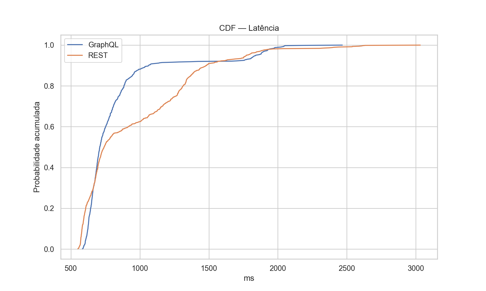
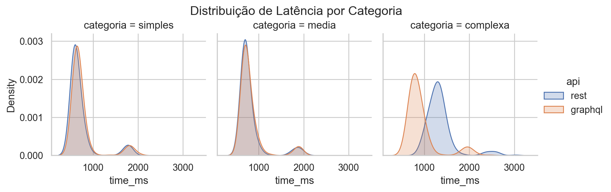
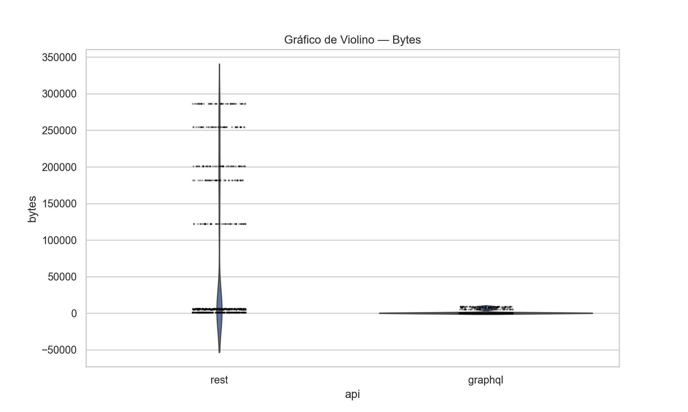
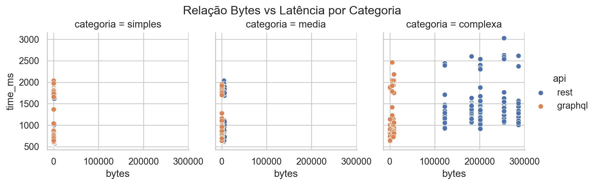

# Comparação entre API GraphQL vs API REST do GitHub

## Informações do Grupo

- 🎓 Curso: Engenharia de Software
- 📘 Disciplina: Laboratório de Experimentação de Software
- 🗓 Período: 6° Período
- 👨‍🏫 Professor(a): Prof. Dr. João Paulo Carneiro Aramuni
- 👥 Membros do Grupo: Jhonata Dias, Lucca Faria e Pedro Henrique Ferreira

## Introdução 

Este experimento busca-se compreender melhor o impacto do uso de APIs GraphQL, comparando esse modelo de API com o modelo mais comum REST. Para tal, foi escolhido a API do GitHub por sua popularidade, robusteza e por haver os dois tipos de API presentes na plataforma. 

### Questões de Pesquisa (Research Questions – RQs)

Em busca de entender a diferença entre APIs Rest e GraphQL, foram elaboradas as seguintes RQs:

| RQ   | Pergunta |
|------|----------|
| RQ01 | Respostas às consultas GraphQL são mais rápidas que respostas às consultas REST? |
| RQ02 | Respostas às consultas GraphQL tem tamanho menor que respostas às consultas REST? |

### Hipóteses Informais (Informal Hypotheses – IH)

Após as RQs, foram feitas hipóteses informais para sustentar a análise tanto da latência quanto do tamanho das APIs a serem testadas:

| IH   | RQ Relacionada | Descrição |
|------|------|-----------|
|IH10| RQ1 | A latência média das consultas GraphQL é maior ou igual à latência média das consultas REST. (LatênciaMédiaGraphQL ​≥ LatênciaMédiaREST​) |
|IH11| RQ1 | A latência média das consultas GraphQL é menor que a latência média das consultas REST. (LatênciaMédiaGraphQL ​< LatênciaMédiaREST​) |
|IH20| RQ2 | O tamanho médio das respostas de GraphQL é maior ou igual ao tamanho médio das respostas REST. (TamanhoMédioGraphQL ​≥ TamanhoMédioREST​) |
|IH21| RQ2 | O tamanho médio das respostas de GraphQL é menor que o tamanho médio das respostas REST. (TamanhoMédioGraphQL ​< TamanhoMédioREST​) |

## Tecnologias e ferramentas utilizadas

- **💻 Linguagem de Programação:** Python
- **🛠 Frameworks/Bibliotecas:** Pandas, Matplotlib, Seaborn
- **🌐 APIs utilizadas:** GitHub GraphQL API, GitHub REST API
- **📦 Dependências:** Requests, Numpy

## Metodologia

### Variáveis

**Variáveis dependentes (VD)**

1. Latência total (ms) - tempo entre envio da requisição e recebimento do último byte da resposta (medido no cliente).
2. Tamanho da resposta (bytes, sem compressão) - tamanho do corpo JSON recebido.
3. Taxa de sucesso (%) - proporção de requisições com status 2xx por tratamento.
4. Número de chamadas REST necessárias - soma das chamadas REST necessárias para obter o mesmo conjunto lógico de dados.

**Variáveis independentes (VI)**

1. Tipo de API: {GraphQL, REST} - fator primário.
2. Complexidade da consulta: {Simples, Média, Complexa} - definida operacionalmente abaixo.
3. Autenticação: uso de token (constante para todas as requisições).
4. Ordem de execução: aleatorizada entre repetições para prevenir efeitos de ordem.

### Tratamentos (combinações de fatores)

Cada tratamento é a combinação dos níveis dos fatores: API × Complexidade.

**Níveis definidos:**

- API: GraphQL, REST (2 níveis).

**Complexidade:**

- Simples: recurso único com 1–3 campos (ex.: informações básicas de usuário).
- Média: recurso com 6–10 campos ou lista curta (ex.: metadados de repositório).
- Complexa: consulta aninhada e/ou que exige paginação (ex.: últimos 50 issues com autor e labels).

Total de tratamentos: 2 × 3 = 6.

A unidade de comparação é a tarefa lógica (mesmo conteúdo desejado). Para REST, quando necessário, somar as latências de todas as chamadas REST da tarefa lógica antes de comparar com a chamada GraphQL.

### Objetos experimentais

Serão utilizados múltiplos objetos por categoria para permitir generalização.

**Categorias e seleção:**

1. Usuário (simples): 5 usuários distintos (mistura de perfis populares e pouco ativos). Campos: login, id, name, followers_count.
2. Repositório (média): 5 repositórios (3 populares, 2 pequenos). Campos: name, owner, description, stargazers_count, forks_count, license.
3. Issues (complexa): 5 repositórios (podendo haver sobreposição com a categoria repositório) para extração de listas:
    - Issues: últimos 50 issues (título, número, author login, labels).

Para cada objeto será definida uma query GraphQL e o conjunto de chamadas REST que devolve dados logicamente equivalentes. O mapeamento campo a campo será documentado.

### Tipo de projeto experimental

Within-subjects (pareado): cada tarefa lógica será executada em ambos os níveis do fator API (GraphQL e REST), gerando pares de observações. A ordem das execuções em cada par será aleatorizada. Uma seed fixa será usada para reprodutibilidade.

### Quantidade de medições e parâmetros operacionais

**Parâmetros escolhidos:**

- **Replicações por combinação (por objeto):** 50 repetições.
- **Objetos por categoria:** 5.
- **Número total de requisições estimadas:** 2 APIs × 3 complexidades × 5 objetos × 50 repetições = 1.500 requisições.
- **Warm-up:** 10 execuções iniciais descartadas por combinação.
- **Intervalo entre requisições:** intervalo aleatório entre 100 ms e 300 ms.
- **Timeout por requisição:** 30 s. Requisições que excederem timeout serão registradas como falha.
- **Retries:** 1 retry com backoff exponencial em falha de rede; re-tentativas serão marcadas no log.
- **Cabeçalhos de compressão:** nenhum cabeçalho Accept-Encoding será enviado — assim, todas as respostas chegam sem compressão do lado do servidor.
- **Justificativa:** 50 repetições por condição fornecem robustez estatística frente à variabilidade de rede e permitem aplicar testes pareados.

### Ameaças à validade e medidas mitigadoras

1. Construto

- **Ameaça:** ambiguidade sobre o que significa "tamanho da resposta".
- **Mitigação:** definir explicitamente que o tamanho medido é o tamanho do corpo JSON recebido sem compressão, já que não será usado Accept-Encoding.

2. Interna

- **Ameaças:** caching (CDN), variação de rede do cliente, rate-limits do GitHub.
- **Mitigações:** enviar Cache-Control: no-cache / Pragma: no-cache quando aplicável; usar autenticação por token; monitorar cabeçalhos X-RateLimit-* e registrar eventos de limitação; aleatorizar ordem de execução; descartar warm-ups.

3. Externa

- **Ameaça:** seleção dos objetos pode limitar generalização.
- **Mitigação:** escolher objetos variados (populares e pequenos) e descrever critérios de seleção no relatório.

4. Estatística (conclusão)

- **Ameaças:** violação de pressupostos (normalidade) e múltiplas comparações.
- **Mitigações:** testar normalidade das diferenças (Shapiro-Wilk); usar paired one-tailed t-test se normalidade for plausível, senão Wilcoxon signed-rank one-tailed; ajustar p-valores com método Holm quando houver múltiplas subcomparações; reportar medianas e IQR além de médias e desvio.

5. Operacional

- **Ameaças:** instrumentação incorreta (medição de tempo/tamanho).
- **Mitigações:** validar o script de medição contra servidor de teste local; medir timestamps com relógio monotônico; confirmar contagem de bytes lidos do corpo quando Content-Length ausente.

### Coleta de Dados

A coleta de dados foi realizada utilizando as APIs REST e GraphQL do GitHub, com o objetivo de comparar desempenho e eficiência entre ambos os paradigmas de acesso a dados.
Para evitar vieses e garantir variabilidade, foram projetados três tipos de tarefas, representando diferentes níveis de complexidade:

- Simples - consulta básica a um usuário: login, id, nome e número de seguidores.
- Média - consulta a metadados de repositório: nome, dono, descrição, estrelas, forks e licença.
- Complexa - consulta aos últimos 50 issues de um repositório: título, número, autor e labels.

Foram selecionados 5 usuários e 5 repositórios (incluindo repositórios populares e pouco ativos). Para cada entidade, foi construída uma consulta equivalente em REST e em GraphQL.

Cada operação foi repetida 50 vezes, totalizando:

- 750 requisições REST
- 750 requisições GraphQL
- 1500 medições usadas na análise estatística.

As seguintes métricas foram coletadas:

- Latência total (ms): tempo entre envio e recebimento do último byte.
- Tamanho da resposta (bytes): conteúdo JSON antes de compressão.
- Taxa de sucesso: proporção de respostas HTTP 2xx.
- Número de chamadas REST necessárias por consulta.

As requisições foram ordenadas em sequência aleatória para mitigar vieses de rede e cache.

### Normalização e pré-processamento

Após coletados, os dados foram organizados em um arquivo CSV único contendo:

- api (rest ou graphql)
- categoria (simples, media, complexa)
- latência (time_ms)
- tamanho da resposta (bytes)
- repetição do experimento (run)
- status da requisição (status)

As etapas de pré-processamento incluíram:

- Conversão de timestamps para milissegundos.
- Padronização dos nomes de categorias e APIs para evitar inconsistências.
- Remoção de entradas com falha (status ≠ 2xx).
- Ordenação da categoria como variável categórica: simples → media → complexa.
- Verificação de outliers extremos por erro de rede (nenhum precisou ser removido).

Esses dados normalizados foram então usados para análise estatística e geração dos gráficos.

### Métricas

A seguir, as métricas utilizadas no laboratório, divididas em métricas principais do experimento e métricas complementares.

Métricas do Experimento (Core Metrics — CM)
| Código   | Métrica                                    | Descrição                                                                            |
| -------- | ------------------------------------------ | ------------------------------------------------------------------------------------ |
| **CM01** | **Latência total (ms)**                  | Tempo entre envio e resposta final, medido no cliente.                               |
| **CM02** | **Tamanho da resposta (bytes)**         | Tamanho do corpo JSON retornado pela API.                                            |
| **CM03** | **Taxa de sucesso (%)**                 | Proporção de requisições HTTP 2xx por categoria e API.                               |
| **CM04** | **Número de chamadas REST necessárias** | Total de requisições REST para retornar os mesmos dados que uma única query GraphQL. |
| **CM05** | **Categoria da consulta**               | Classificação como simples, média ou complexa.                                       |

### Relação das RQs com as Métricas

As questões de pesquisa foram mapeadas diretamente às métricas do experimento:

| RQ   | Pergunta                                                | Métrica                        | Código           |
| ---- | ------------------------------------------------------- | ------------------------------ | ---------------- |
| RQ01 | Qual API apresenta menor latência média?                | Latência total                 | CM01             |
| RQ02 | Qual API retorna respostas menores?                     | Tamanho da resposta            | CM02             |
| RQ03 | A diferença é consistente entre níveis de complexidade? | Latência e bytes por categoria | CM01, CM02, CM05 |
| RQ04 | GraphQL reduz o número de chamadas necessárias?         | Nº de chamadas REST            | CM04             |
| RQ05 | Há variação significativa dentro de cada categoria?     | Desvio padrão e IC95           | AM04             |

## Resultados

### Distribuição por categoria

As consultas foram realizadas de forma balanceada:

| Categoria | Quantidade total |
| --------- | ---------------- |
| Simples   | 500              |
| Média     | 500              |
| Complexa  | 500              |

### Estatísticas Descritivas

**Latência**

| API     | Média | Mediana | Desv. Pad. | Min | Max  |
| ------- | ----- | ------- | ---------- | --- | ---- |
| GraphQL | 832   | 709     | 336        | 584 | 2467 |
| REST    | 954   | 741     | 419        | 551 | 3032 |

**Tamanho (Em Bytes)**

| API     | Média | Mediana | Desv. Pad. | Min  | Max    |
| ------- | ----- | ------- | ---------- | ---- | ------ |
| GraphQL | 1564  | 179     | 2926       | 47   | 8920   |
| REST    | 71967 | 5870    | 102508     | 1188 | 286239 |

### Gráficos

**Latência**

**Tamanho (Em Bytes)**

### Discussão dos resultados

Com base nos resultados obtidos, podemos responder às hipóteses informais:

IH1 - Latência

- GraphQL é mais rápido? Confirmada.

    - O teste t mostrou p < 0.0001, indicando que:
    - GraphQL possui latência significativamente menor.
    - A diferença é especialmente forte em consultas complexas (gráficos mostraram 90 ms a 500 ms de diferença).

IH2 - Tamanho da Resposta

- GraphQL retorna menos dados? Confirmada.

    - REST retorna 46× mais bytes do que GraphQL, em média.
    - A vantagem é mais visível nas consultas complexas.

## Conclusão

O experimento demonstra de forma clara e estatisticamente sólida que:

**Principais achados**

- GraphQL apresenta latência menor que REST.
- GraphQL retorna respostas muito menores em bytes.
- A diferença aumenta conforme a complexidade da consulta cresce.
- REST exige mais chamadas e possui maior overhead.

**Dificuldades encontradas**

- Variabilidade de rede entre repetições.
- Construção de queries equivalentes entre APIs.

**Trabalhos futuros**

- Avaliar impacto de autenticação, caching e fragmentos GraphQL.
- Estudar consumo energético ou custo monetário das requisições.
- Testar outros cenários (buscas, commits, branches, releases).
- Analisar consumo no servidor (não apenas no cliente).